# How We Built AdClaw

> A deep dive into the architecture, tech decisions, and integration of every component.

---

## System Architecture

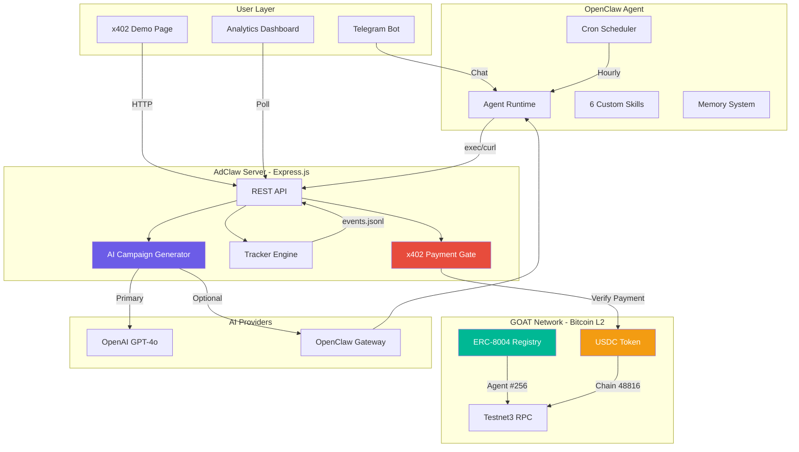

---

## Request Flow: x402 Payment → AI Campaign

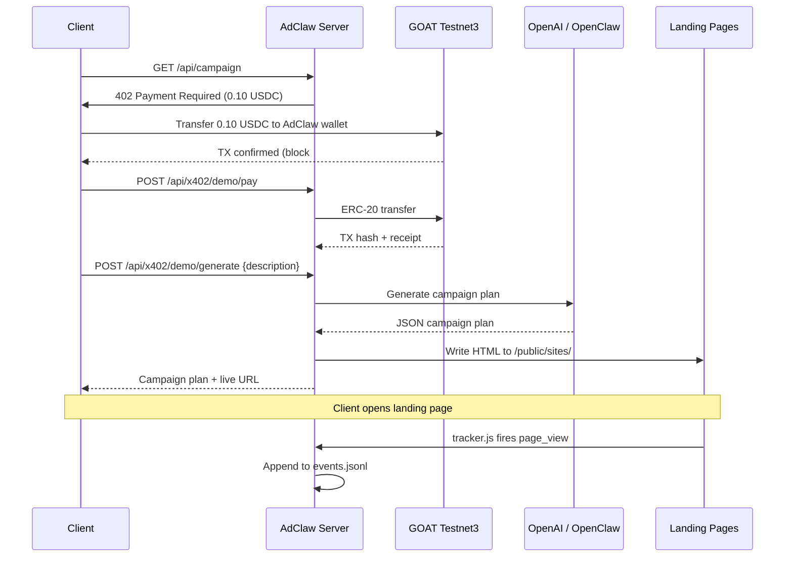

---

## Component Breakdown

### 1. Express.js Server (Port 3402)

The core API server handling all HTTP requests.

```mermaid
graph LR
    subgraph Routes
        R1[/api/campaign]
        R2[/api/landing]
        R3[/api/event]
        R4[/api/track]
        R5[/api/report]
        R6[/api/x402/demo]
        R7[/api/x402/webhook]
    end

    subgraph Middleware
        CORS[CORS]
        COMP[Compression]
        AUTH[Internal Auth]
        PAY[x402 Gate]
    end

    subgraph Static
        S1[/sites/*.html]
        S2[/events/*.html]
        S3[/dashboard/]
        S4[/x402-demo/]
        S5[/tracker.js]
    end

    REQ[Request] --> CORS --> COMP --> AUTH --> PAY --> Routes
    REQ --> Static
```

**Why Express.js?**
- Lightweight, zero-config, starts in <1 second
- Static file serving built-in (no nginx needed)
- TypeScript for type safety across all routes
- Compression middleware for smaller payloads over ngrok

**Key design decisions:**
- **JSONL for events** — append-only writes, no race conditions under concurrent tracking requests
- **Atomic JSON writes for campaigns** — write to `.tmp` then `fs.renameSync` to prevent corruption
- **HTML escaping on all injected values** — prevents stored XSS via campaignId in tracker script tags
- **Global error handler** — no unhandled exception crashes the server during demo

---

### 2. x402 Payment Gate

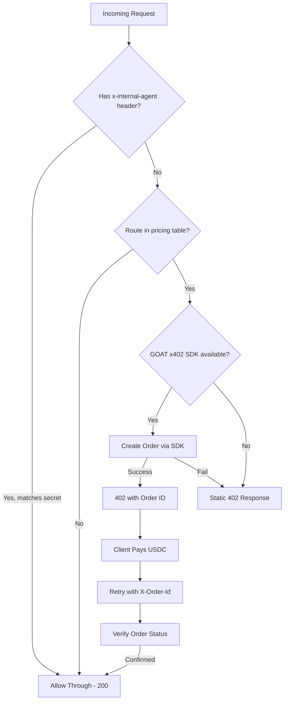

**Pricing table:**

| Endpoint | Price | USDC Wei |
|----------|-------|----------|
| `/api/campaign` | 0.10 USDC | 100,000 |
| `/api/landing` | 0.30 USDC | 300,000 |
| `/api/event` | 0.20 USDC | 200,000 |
| `/api/report` | 0.05 USDC | 50,000 |

**Why this design?**
- Internal agent bypasses payment via shared secret — the agent shouldn't pay itself
- Fallback chain: SDK → static 402 — demo works even when GOAT API is unreachable
- GOAT x402 SDK is ESM-only; loaded via dynamic `import()` to work with our CommonJS build

---

### 3. ERC-8004 On-Chain Identity

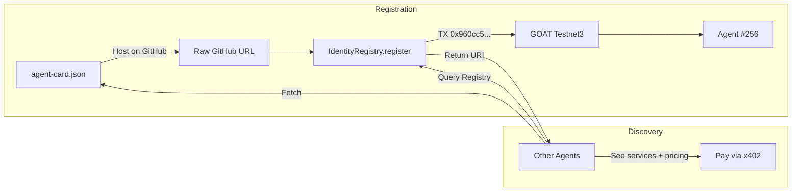

**Contract:** `0x556089008Fc0a60cD09390Eca93477ca254A5522` (Testnet3)

**Agent Card structure:**
```json
{
  "name": "AdClaw — Autonomous Marketing Agency",
  "x402Support": true,
  "services": [
    { "name": "campaign-plan", "endpoint": "/api/campaign" },
    { "name": "landing-page", "endpoint": "/api/landing" },
    { "name": "event-page", "endpoint": "/api/event" },
    { "name": "analytics-report", "endpoint": "/api/report" }
  ],
  "registrations": [{ "agentId": "256" }]
}
```

**Technical notes:**
- ethers.js v6 with bracket notation `registry['register(string)']` to disambiguate overloaded functions
- Agent URI updated on-chain via `setAgentURI` after GitHub push
- Two confirmed TXs: registration + URI update

---

### 4. Landing Page Generator

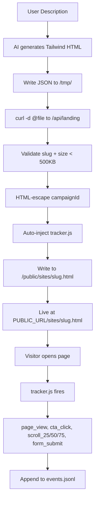

**Why file-based deployment (not inline curl)?**
- HTML in curl `-d` argument breaks on quotes, backticks, `$(...)` patterns
- File-based: agent writes JSON to `/tmp/`, then `curl -d @file` — zero escaping issues
- This was the #1 risk identified in code review and fixed before build

---

### 5. Analytics Tracking

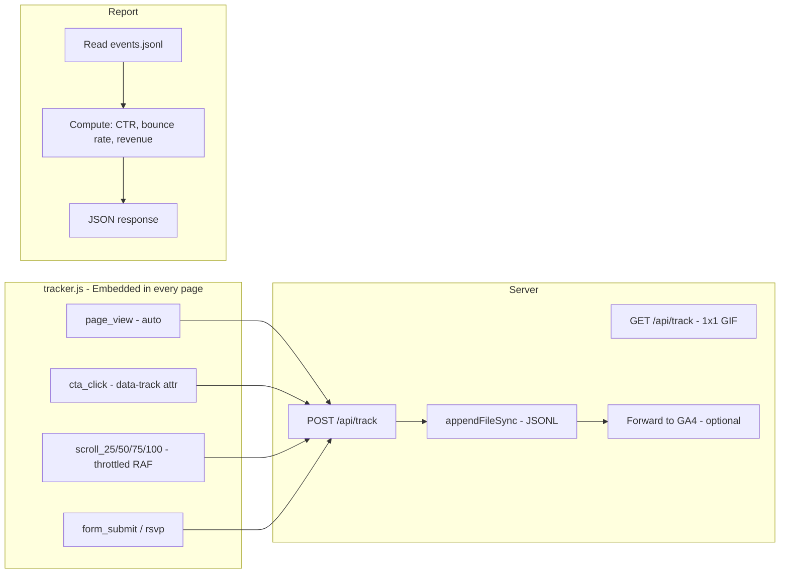

**Key design decisions:**
- **Append-only JSONL** — no read-modify-write race conditions
- **Server-side timestamps** — client timestamps can't be trusted
- **`requestAnimationFrame` throttle on scroll** — prevents 60 events/sec
- **`localStorage` in try/catch** — Safari private browsing throws on access
- **Division-by-zero guard** — when content fits viewport, `scrollable <= 0`

---

### 6. OpenClaw Agent Skills

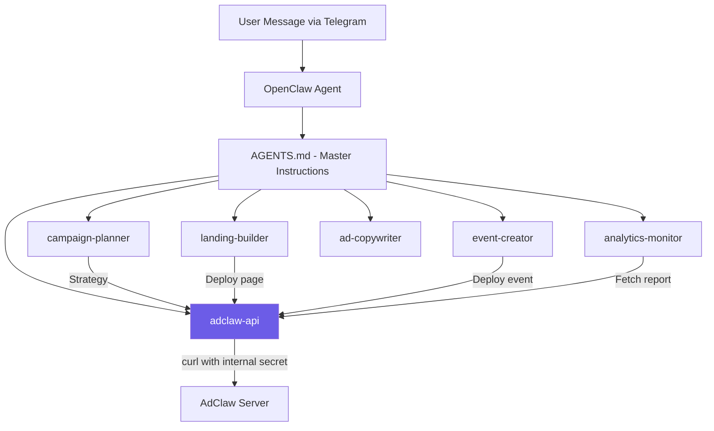

**6 skills, each a `SKILL.md` file:**

| Skill | Purpose | Uses exec? |
|-------|---------|-----------|
| `campaign-planner` | Strategy, budget, KPIs, timeline | No (pure LLM) |
| `landing-builder` | Generate HTML, deploy via API | Yes (file write + curl) |
| `event-creator` | Event page with RSVP | Yes (file write + curl) |
| `ad-copywriter` | Google + Meta ad copy with char limits | No (pure LLM) |
| `analytics-monitor` | Read reports, suggest optimizations | Yes (curl) |
| `adclaw-api` | API reference with examples | No (reference only) |

---

### 7. AI Generation (Dual Backend)

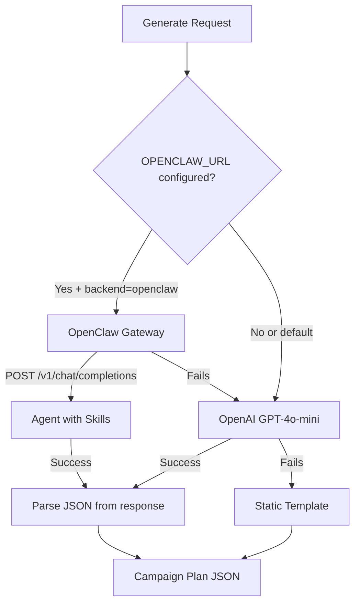

**Why dual backend?**
- **OpenAI** (default): works instantly, no Docker needed, GPT-4o-mini is fast + cheap
- **OpenClaw** (optional): shows the full agent pipeline for the hackathon — request goes through the agent runtime with all 6 skills loaded
- **Fallback**: if both fail, returns a structured template — demo never breaks

---

### 8. Docker Compose Architecture

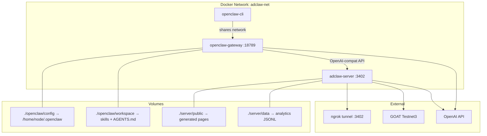

**Three services:**
1. `openclaw-gateway` — AI agent runtime with Telegram, cron, skills
2. `openclaw-cli` — onboarding & management (runs on demand)
3. `adclaw-server` — Express API, pages, tracking, payments, dashboard

---

## On-Chain Transactions

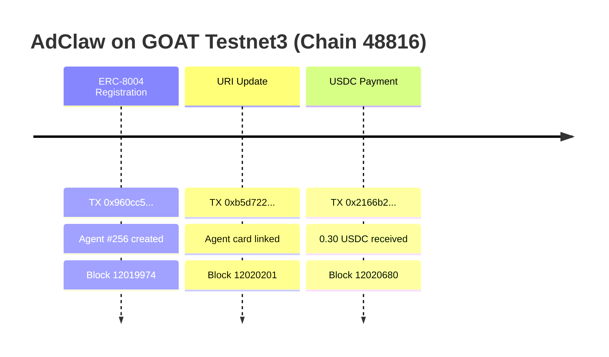

| TX | Purpose | Hash |
|----|---------|------|
| Agent Registration | ERC-8004 identity created | `0x960cc533b164ff451306bb07b5f5edba92b95a2a8854809f0ac09cd656605e6c` |
| URI Update | Link agent card JSON | `0xb5d722d0ddc866175928df3b6d310a7e3344aa5c6352db36a24f448ca4947dc3` |
| USDC Payment | Real x402 payment (0.30 USDC) | `0x2166b255876d2ab2f79292d6f04432f6380834c732d80abc18f73d59bccd7206` |

---

## Security Measures

| Threat | Mitigation |
|--------|-----------|
| XSS via campaignId in HTML | `escapeAttr()` on all injected values |
| Path traversal via slug | `sanitizeSlug()` strips everything except `a-z0-9-` |
| HTML bomb (huge payload) | 500KB size limit on POST |
| Race conditions on write | JSONL append-only for events, atomic rename for campaigns |
| Agent paying its own x402 | `x-internal-agent` header bypass |
| Server crash during demo | Global error handler + try/catch on every route |
| Scroll event spam | `requestAnimationFrame` throttle in tracker.js |
| localStorage errors | try/catch wrapper for Safari private browsing |

---

## Tech Stack Summary

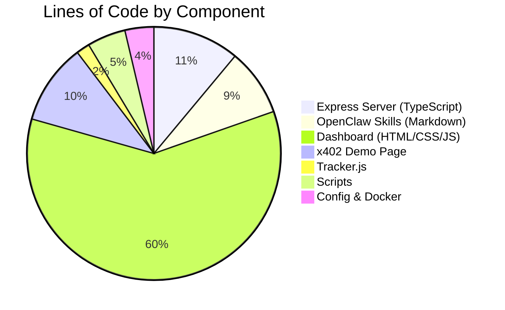

| Technology | Why We Chose It |
|-----------|----------------|
| **TypeScript** | Type safety across routes, catches bugs at build time |
| **Express.js** | Lightweight, no boilerplate, serves static files natively |
| **ethers.js v6** | Best Ethereum library for contract interaction |
| **GOAT x402 SDK** | Official SDK for payment order creation |
| **OpenAI GPT-4o-mini** | Fast, cheap, good at structured JSON output |
| **Tailwind CSS (CDN)** | Zero build step for generated pages |
| **Vanilla JS** | Dashboard loads in <100ms, no framework overhead |
| **JSONL** | Append-only, concurrent-safe, no database needed |
| **Docker Compose** | Two services orchestrated with health checks |
| **ngrok** | Instant public URL for demo |

---

*Built solo at OpenClaw Hack 2026, Chennai. Agent #256 on GOAT Testnet3.*
